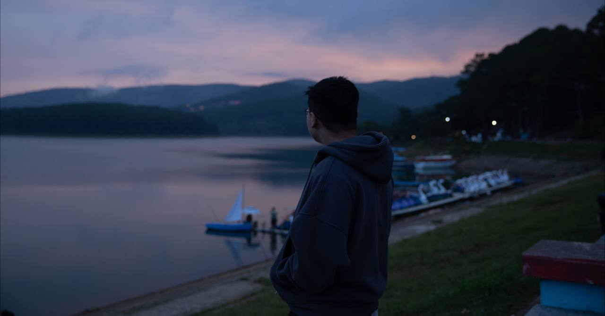

# About me
Hi there! My name is **Nguyễn Hồ Đăng Duy**, but you can call me **Denver Nguyễn** (and I usually go online by **D3nverNg** — because adding numbers to your name instantly makes you 1337, right?).

I’m currently studying **Computer Networks & Telecommunications – Information Security** at **University of Science, Ho Chi Minh City** (f*cking long). My dream? To become a skilled **penetration tester (red team–oriented)** so that one day I can afford an XSR 155 (or the 900cc if life treats me well...) and maybe a Porsche 911!!!

### Skills
- **Operating Systems**: I dual-boot Windows and Linux (Ubuntu & Kali) for pentesting and CTFs. Diving into red team skills has forced me to understand not just how to hack systems, but also how they actually work under the hood.
- **Pentesting**: Completed the [Web Penetraation Testing course](https://www.linkedin.com/posts/nhdduy67_im-excited-to-share-that-ive-officially-activity-7354030115342733312-xteg?utm_source=share&utm_medium=member_desktop&rcm=ACoAACieTKsBRDabRi0wlJlffFKqO1Dfd62lTZA)  at CyberJutsu Academy and currently leveling up with PortSwigger labs. Comfortable with exploiting the usual suspects like SQLi, XSS, XXE, etc. I also join weekly CTFs to sharpen my skills (and make friends who also think breaking things is fun).
- **Red Teaming**: Enrolled in CyberJutsu’s Red Team course and playing HackTheBox for more experience. I know it’s a long, tough journey and the line between “Senior Pentester” and “Red Teamer” can be blurry… but hey, why stop when the road is just getting interesting?!

### Habits & Hobbies:
- **Books**: I love reading history, science, and the occasional night novel on my Kindle. Also dabbling in IT & security blogs/books. (You can check out my [Goodreads](https://www.goodreads.com/di_nguyen) if you’re curious about my reading trail!)
- **Sports**: I hit the gym regularly. Some say I’m overweight, but I prefer to call it bulking season 🐧
  
# About this blog
I started this blog as a place to record the knowledge I’ve picked up along my learning journey — both in security and in life. Sometimes it might be a write-up of a CTF I’ve joined, a solution for a HackTheBox machine, or just a book I found inspiring.

At the same time, this blog is also my way of practicing English writing skills. I hope that by keeping up the habit of writing, I’ll remind myself to use English more often and (hopefully) get better at it over time.

I also hope you’ll find something useful here — whether it’s a tip, a resource, or just a small spark of motivation.

